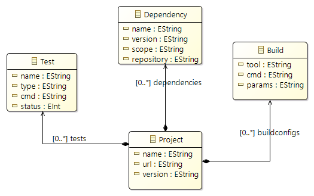
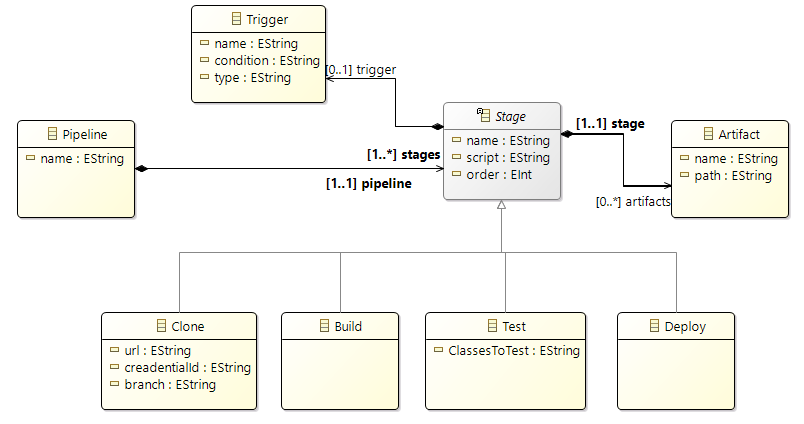

# MDEploy

## Definitions

## Metamodels

### Initial project configuration metamodel:

    

### Gitlab metamodel:

Following Gitlab's core concepts, a pipeline is composed of multiple stages (we limited it to "cloning," "tests," "build," and "deploy").
A pipeline is triggered by a condition withing a 'Trigger'.
Each stage may generate some artifacts.

    

