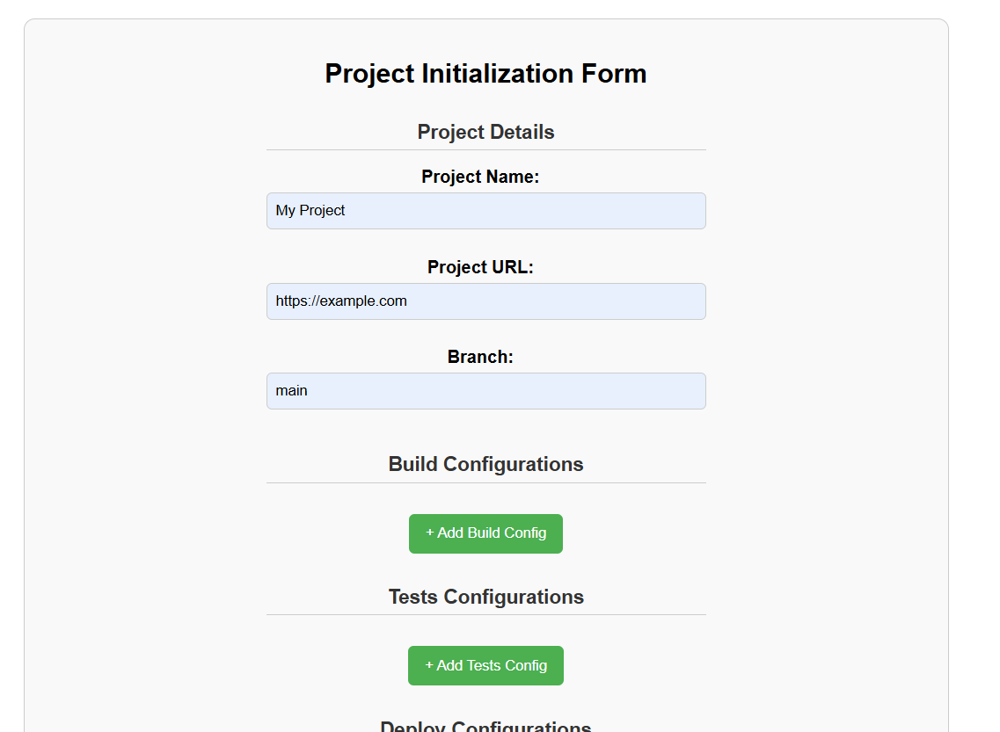
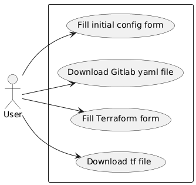
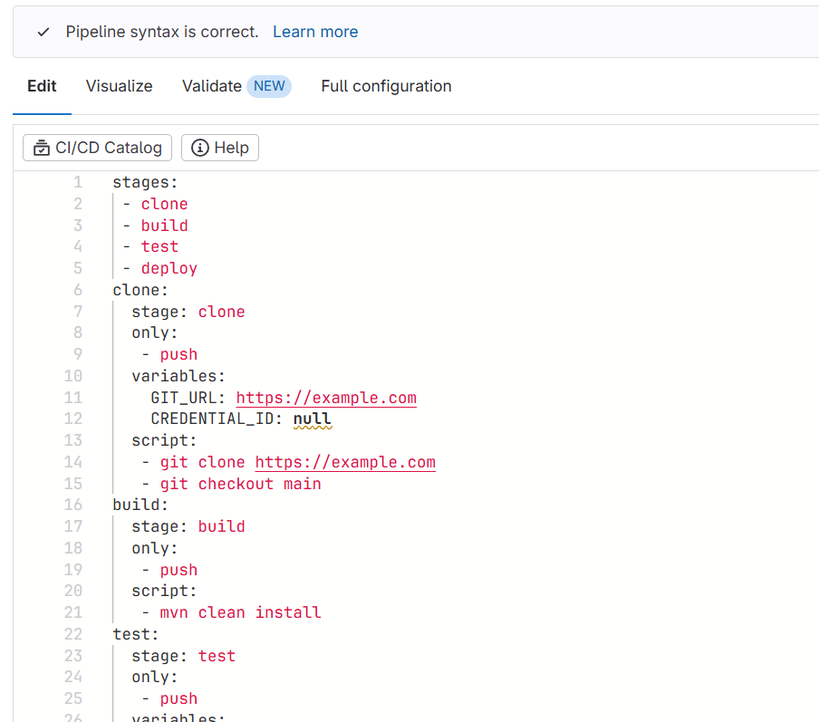
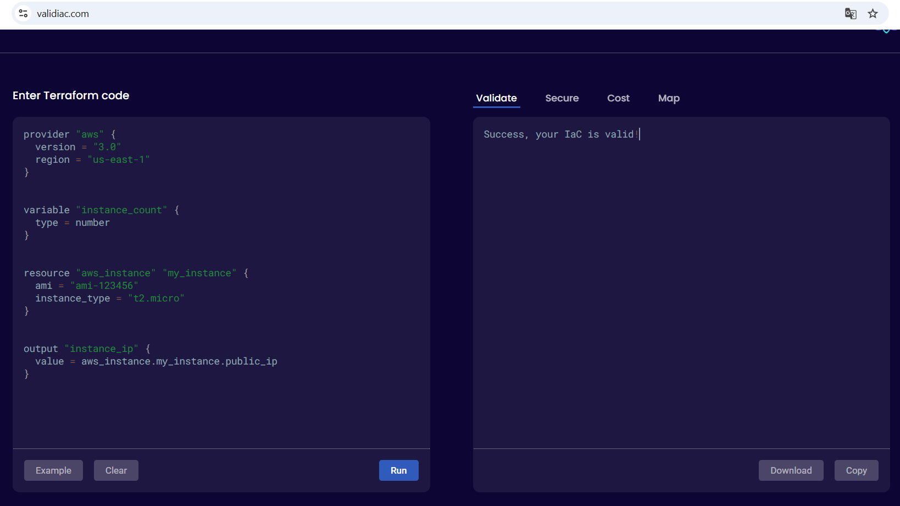

# MDEploy

## Overview

<p align="center">
    
</p>

## Table of content

- [Requirements](#requirements)
- [Metamodels](#metamodels)
  - [Initial project configuration metamodel](#initial-project-configuration-metamodel)
  - [Gitlab metamodel](#gitlab-metamodel)
- [T2M transformation](#t2m-transformation)
- [M2M transformation](#m2m-transformation)
- [M2T transformation](#m2t-transformation)
- [T2M transformation: Converting JSON data into terraform model](#m2t-transformation-converting-json-data-into-terraform-model)
- [Web API](#web-api)
  - [Project structure](#project-structure)
  - [Use case diagram](#use-case-diagram)
- [Validating generated files](#validating-generated-files)
  - [gitlab-ci.yml](#gitlab-ciyml)
  - [main.tf](#maintf)
- [Contributors](#contributors)

## Requirements

- Eclipse Modeling Tools 2022 [Find here](https://www.eclipse.org/downloads/packages/release/2021-03/r/eclipse-modeling-tools)
- Eclipse Epsilon

## Metamodels

### Initial project configuration metamodel

<p align="center">
    
</p>

### Gitlab metamodel

<p align="center">
    
</p>

### Terraform metamodel

<p align="center">
    
</p>

## T2M transformation

- T2M (Text-to-Model) transformation allows generating a structured model from unstructured or semi-structured textual data. It is often used in scenarios where textual specifications or configurations need to be translated into formal models for further processing.
- The script `JsontToModel.java` parses JSON data and converts it to an initConfig model of XMI format.
- We used 2 java scripts to read from input JSON files which would be sent from the client (frontend), one for parsing initConfig-related data, and the other for Terraform.

## M2M transformation

- M2M (Model-to-Model) transformation refers to the process of converting one model into another.
- Eclipse Epsilon ETL Transformation rules to transform from initial configuration to gitlab model, by mapping some of their associated attributes and classes.
- In our project, we implemented an M2M transformation from InitConfig to Gitlab.

## M2T transformation

- On the other hand, M2T transformation allpows generating textual artifacts from models. This is often used to produce source code, documentation, or configuration files from structured models.
- In our case, to generate the Gitlab YAML and Terraform `.tf` files.

## Web API

To automate these different transformations, we can integrate our MDE files with a Spring RESTful API. 
By importing the necesseray EMF library into the SpringBoot project, we can exploit models. 

### Project structure
```
src/main/java/com/example/mde
├── controller
│   └── ProjectController.java
│   └── TerraformController.java
├── model
│   └── initConfig
│   └── gitlab
│   └── terraform
├── service
│   └── ProjectService.java
│   └── TerraformService.java
├── util
    └── JsonToModel.java
    └── ...
```

### Use case diagram

<p align="center">
    
</p>

## Validating generated files

### gitlab-ci.yml

After testing the generated `gitlab-ci.yml` file on Gitlab, we can find it conforms to the yml syntax:

<p align="center">
    
</p>

### main.tf

We can also test the `main.tf` file on [ValidIaC](https://validiac.com/), we can find that the syntax is correct:

<p align="center">
    
</p>


## Contributors

- [@Cristal32](https://github.com/Cristal32)
- [@HM2811](https://github.com/HM2811)
- [@fatibr19](https://github.com/fatibr19)
- [@lamAz19](https://github.com/lamAz19)
